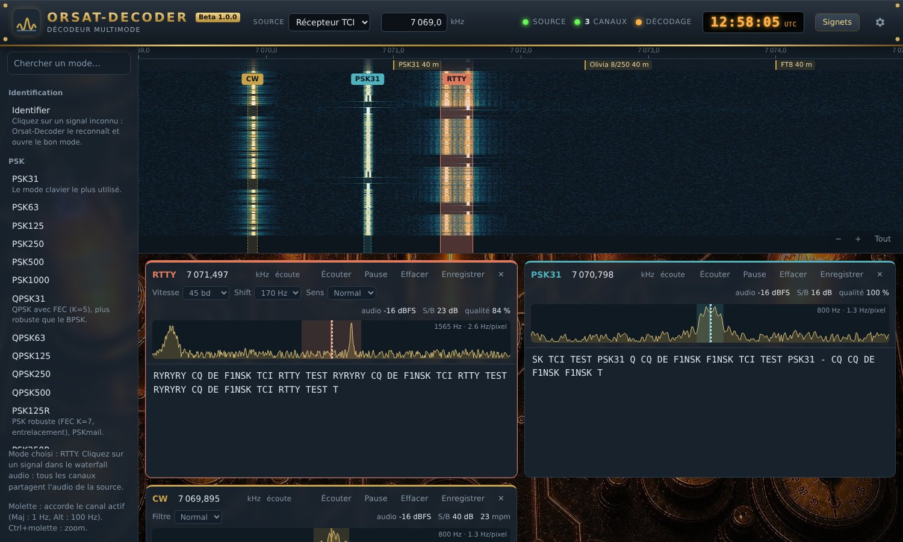
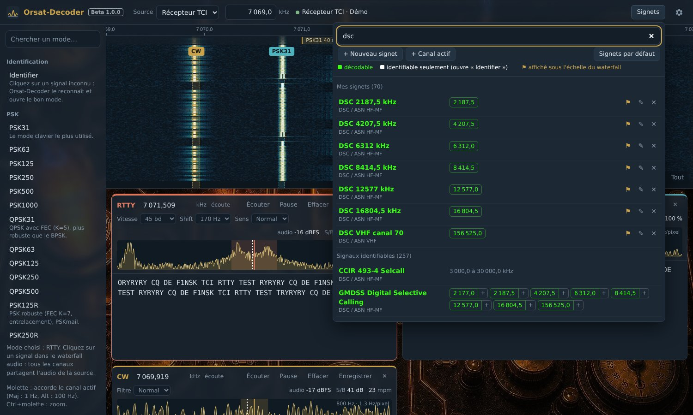

# Orsat-Decoder

**Décodeur multimode natif pour Linux.** Un seul logiciel, sans Wine, qui reçoit l'audio d'un WebSDR
PhantomSDR / Orsat-SDR, d'un récepteur TCI (AetherSDR, ExpertSDR, Thetis…) ou de la carte son, et
décode en parallèle autant de canaux que l'on veut : texte, images, signaux faibles, maritime,
aviation, signaux horaires… Il sait aussi **reconnaître un signal inconnu** et ouvrir tout seul le
bon décodeur.



## Installation

Copiez cette ligne dans un terminal :

```bash
curl -fsSL https://raw.githubusercontent.com/f1nsk40260/Orsat-Decoder/main/get.sh | bash
```

C'est tout : ni git, ni compte GitHub. Seul le mot de passe de votre session Linux peut être demandé
(sudo), une fois, s'il manque des paquets. Debian, Ubuntu, Mint, Fedora, Arch et openSUSE sont pris en
charge.

**Mise à jour** : la même ligne. La configuration et les canaux sont conservés.
**Désinstallation** : `~/Orsat-Decoder/uninstall.sh`.

L'installateur :
- installe Python et un compilateur C s'ils manquent ;
- installe tout dans le dossier **`~/Orsat-Decoder`** de votre dossier personnel ;
- y crée son environnement Python (`venv/`) ;
- compile les décodeurs natifs embarqués (FT8/FT4, WSPR) ;
- ajoute **Orsat-Decoder** au menu des applications ;
- termine par un autotest de chaque décodeur.

```
~/Orsat-Decoder/
  orsatdec/  web/  native/  tests/   le logiciel
  venv/                              son environnement Python
  config.json                        vos sources, canaux et réglages
  orsat-decoder.log                  journal de la dernière session
  images/                            fax et images SSTV reçus (PNG)
  install.sh  get.sh  uninstall.sh   installation, mise à jour, désinstallation
```

## En bref

- **Plus de 90 modes** en réception, de PSK31 à HFDL, voir le tableau ci-dessous.
- **Plusieurs canaux en même temps**, chacun avec son mode, sa fréquence, son mini-spectre et son
  texte. Sur un serveur PhantomSDR, chaque canal a son propre flux audio et peut être n'importe où
  dans la bande.
- **Identification automatique** : on clique sur un signal inconnu, Orsat-Decoder le compare aux
  257 signaux de la base Artemis (sigidwiki), essaie les décodeurs des meilleurs candidats et ouvre
  le bon mode quand un texte lisible sort.
- **Annuaire des fréquences** : tous les signaux identifiables, avec leurs fréquences connues, en un
  clic.
- **Interface web locale** : elle s'ouvre dans une fenêtre, ou depuis un autre PC du réseau avec
  `--lan`.
- **Réception uniquement** : aucune fonction d'émission.

## Modes décodés

| Famille | Modes | Sensibilité mesurée (bruit dans 2500 Hz) |
|---|---|---|
| PSK | PSK31, 63, 125, 250, 500, 1000 ; QPSK31 à 500 ; PSK-R 125 à 1000 | PSK31 ≈ −11 dB, QPSK31 ≈ −6 dB |
| RTTY et télex | RTTY 45 à 100 bauds (shift réglable), ASCII 110 bauds | RTTY 45 bauds ≈ −8 dB |
| CW | vitesse automatique de 5 à 60 mots/min | ≈ −8 dB à 20 mots/min |
| MFSK | MFSK4 à 128, DominoEX (Micro à 88), THOR (Micro à 100) | MFSK16 −13 dB, THOR 11 −15 dB |
| Olivia | Olivia et Contestia, 4 à 64 tonalités, 125 à 2000 Hz | Olivia 8/250 −16 dB |
| MT63 | 500, 1000, 2000, entrelacement court ou long | MT63-1000 ≈ −8 dB |
| Autres modes fldigi | THROB et THROBX 1/2/4, FSQ, IFKP | ≈ −10 dB |
| Signaux faibles | FT8, FT4, WSPR, JT65A/B, JT9, JS8 (normal, rapide, turbo, lent) | FT8 −18 dB, WSPR −24 dB, JT9 −22 dB |
| Images | fax météo (IOC 576/288, 60 à 240 lignes/min), SSTV (Martin, Scottie, Robot, PD, Wraase, code VIS automatique), Hellschreiber (Feld, Slow, X5, X9, FSK Hell, Hell 80) | |
| Maritime | Navtex / SITOR-B, SITOR-A (AMTOR ARQ), DSC/ASN HF-MF et VHF, DGPS (corrections GPS RTCM) | Navtex −8 dB, DSC −3 dB |
| TOR / ARQ | PACTOR I en écoute (ARQ et FEC, 100/200 bauds, Memory-ARQ, Huffman) | ≈ 0 dB |
| Packet | AX.25 300 bauds (HF) et 1200 bauds (APRS en FM), positions APRS | 300 bauds ≈ +3 dB |
| Aviation | HFDL (positions des avions sur une carte, ACARS, squitters des 16 stations au sol), ACARS VHF, Selcal OACI | |
| Appels sélectifs | DTMF, 5 tons (CCIR, EEA, ZVEI…), selcall CCIR 493-4, POCSAG 512/1200/2400 | |
| ALE | ALE 2G (MIL-STD-188-141) | ≈ −3 dB |
| Signaux horaires | DCF77, MSF, TDF, WWVB, JJY, WWV/WWVH, CHU | |

Chaque décodeur a été vérifié sur un vrai enregistrement de la base Artemis, sauf TDF et CHU
(seulement sur des signaux générés) et HFDL à 600, 1200 et 1800 bits/s (aucun enregistrement
disponible). Les résultats sur signaux réels sont dans [docs/ARTEMIS.md](docs/ARTEMIS.md).

Les modes MFSK, Olivia et MT63 suivent l'émetteur de fldigi bit pour bit. Sur du bruit seul, aucun
décodeur ne doit rien imprimer : la squelch s'appuie sur le code correcteur de chaque mode. En
contrepartie, un canal MFSK/THOR qu'on vient d'ouvrir reste muet quelques secondes (7 s en MFSK16),
le temps de remplir son désentrelaceur, et MT63 affiche le texte avec une dizaine de secondes de
retard. FT8, FT4, WSPR, JT65, JT9 et JS8 décodent toute la bande audio à la fin de chaque créneau UTC.

**Carte HFDL** : le bouton **Carte** d'un canal HFDL affiche les avions dont une position a été reçue
(indicatif du vol, trace, heure), et les stations au sol entendues. Le fond détaillé vient d'OpenStreetMap
(connexion Internet) ; sans Internet, une carte simplifiée des pays, embarquée, le remplace.

**Images** : elles s'affichent dans la carte du canal au fil de la réception. Le fax démarre seul sur
la tonalité de départ et se cale sur les lignes de phasage. Le SSTV démarre sur le code VIS. Chaque
image terminée est enregistrée en PNG dans `~/Orsat-Decoder/images/`.

## Sources

Le menu **Source**, en haut à gauche, choisit d'où vient le signal. Les sources se règlent dans les
réglages (bouton en forme de roue).

| Source | Pour | Fonctionnement |
|---|---|---|
| **PhantomSDR / Orsat-SDR** | serveur ORSAT, Orsat-SDR, tout PhantomSDR-Plus | waterfall large bande du serveur ; chaque canal a son propre flux audio et son propre accord (PCM, FLAC ou Opus) |
| **TCI** | AetherSDR (port 50001), ExpertSDR / SunSDR, Thetis… | audio et fréquence du récepteur sur une seule connexion ; le champ de fréquence en haut réaccorde le récepteur |
| **Entrée audio** | carte son du transceiver, sortie d'un autre logiciel (son « Monitor »), entrées DAX d'AetherSDR | CAT rigctld facultatif (port 4532 : AetherSDR, rigctld, flrig) pour afficher les vraies fréquences et réaccorder |

Avec TCI et l'entrée audio, tous les canaux partagent l'audio BLU du récepteur, et le waterfall montre
cette bande audio. Quand on réaccorde le récepteur, chaque canal reste sur sa station. Sans CAT, les
fréquences affichées sont les fréquences audio (Hz).

## Utilisation

1. Choisissez la source en haut à gauche.
2. Choisissez un mode dans la colonne de gauche, puis **cliquez sur un signal** dans le waterfall : un
   canal s'ouvre. Chaque décodeur retrouve seul son signal dans environ ±100 Hz autour du clic.
3. Ou ouvrez une **fréquence connue** (voir ci-dessous). Avec TCI ou CAT, le récepteur est réaccordé
   automatiquement.

Dans le waterfall :
- **molette : accorde le canal actif**, par pas de 10 Hz (Maj : 1 Hz, Alt : 100 Hz) ;
- Ctrl+molette : zoom ;
- glisser : se déplacer dans la bande ;
- glisser un marqueur de canal : réaccorder ce canal ;
- si la résolution est trop faible pour viser (plus de 20 Hz par pixel), un premier clic zoome autour
  du signal, le second ouvre le canal.

Chaque carte de canal a un **mini-spectre** très résolu (environ 1 Hz par pixel), centré sur le
décodeur. Le trait de couleur marque la fréquence demandée, le pointillé blanc l'endroit où le
décodeur s'est calé. Cliquez sur le signal, ou tournez la molette sur le mini-spectre ou sur la
fréquence, pour un accord précis. La carte a aussi : fréquence modifiable au clavier, paramètres du
mode, pause, effacement, enregistrement du texte, et bouton **Écouter** pour entendre l'audio que
reçoit ce décodeur. Si rien n'arrive pendant 5 s, la carte passe en rouge « pas d'audio reçu » et
indique la raison donnée par le serveur.

### Fréquences connues



Le bouton **Fréquences connues** ouvre un annuaire avec une recherche (nom, mode ou fréquence en kHz) :

- d'abord les fréquences préréglées : Navtex, DSC, fax météo, FT8, JS8, WSPR, HFDL, ACARS… ;
- puis **les 257 signaux identifiables** de la base Artemis, avec leurs fréquences connues et un lien
  vers leur fiche sigidwiki.

En **vert fluo**, les signaux qu'Orsat-Decoder sait décoder : un clic ouvre le décodeur sur cette
fréquence. En **blanc**, ceux qu'il sait seulement reconnaître : un clic ouvre un canal **Identifier**.
Quand la base ne donne qu'une plage (« 3 000 à 30 000 kHz »), elle est affichée en gris.

### Identification automatique

Choisissez **Identifier** (en tête de la colonne des modes), puis cliquez sur un signal inconnu.
Après une dizaine de secondes d'écoute, Orsat-Decoder affiche ses mesures (largeur, tonalités,
vitesse, type de modulation, ACF) et les candidats les plus proches, chacun avec un lien vers sa fiche
sigidwiki. Il fait ensuite tourner les décodeurs des candidats décodables : si l'un d'eux sort un
texte lisible, le bon canal s'ouvre tout seul.

Les signaux qu'il ne décode pas (TOR militaires, STANAG, CLOVER, PACTOR II/III, VARA, radars,
ionosondes…) sont reconnus quand même, mais sans confirmation par décodage : le bon signal est alors
souvent dans les trois premiers sans être forcément premier. Détails et taux de réussite :
[docs/ARTEMIS.md](docs/ARTEMIS.md).

### Ligne de commande

| Commande | Effet |
|---|---|
| `orsat-decoder` | lance l'application |
| `orsat-decoder --check` | autotest des décodeurs (sans serveur) |
| `orsat-decoder --lan` | interface accessible depuis le réseau local (`http://ip:8074/`) |
| `orsat-decoder --log` | journal de la dernière session |
| `orsat-decoder --identify fichier.wav [FREQ_kHz]` | identifie le signal d'un enregistrement et le confirme en le décodant |
| `orsat-decoder --probe URL FREQ_kHz` | diagnostic de connexion : ce que le serveur envoie, niveau, enregistrement de 12 s dans `~/orsat-probe.wav` |

## Limite de connexions

Chaque canal est un auditeur pour le serveur. Un PhantomSDR-Plus limite en général à **3 auditeurs
par adresse IP** (`per_ip` dans `config.toml`).

Lancé **sur la machine du serveur**, Orsat-Decoder n'a pas cette limite. S'il trouve le fichier
`.tap_token` d'Orsat-SDR (dans `~/Orsat-SDR`), ses canaux sont même comptés comme clients internes et
n'apparaissent pas parmi les auditeurs. Les serveurs Orsat-SDR récents refusent les clients qui ne
déclarent pas leur version (`min_client_version`) : Orsat-Decoder la déclare automatiquement.

## Limites connues

- POCSAG à 512 bauds passe mal par un serveur PhantomSDR, dont le filtre anti-continu déforme ce
  débit.
- JT65 est décodé par l'algorithme algébrique de Reed-Solomon (Berlekamp-Massey avec effacements),
  pas par celui de WSJT-X, qui n'est pas libre : environ 4 dB de moins. JS8 est lui aussi un peu moins
  sensible que JS8Call.
- PACTOR I en compression Huffman n'a pas pu être vérifié sur une émission réelle.
- ACARS est sur la bande aviation VHF (AM) : il faut un récepteur qui la couvre.
- Pas encore décodés : FST4/FST4W, MSK144, DominoF, RSID et les modes TOR militaires, dont le trafic
  est le plus souvent chiffré.

## Crédits

Orsat-Decoder s'appuie sur le travail de nombreux auteurs de logiciels libres :

| Composant | Utilisation | Licence |
|---|---|---|
| [ft8_lib](https://github.com/kgoba/ft8_lib) (Karlis Goba) | FT8 et FT4, embarqué | MIT |
| wsprd de WSJT-X (K1JT, K9AN), version [rtlsdr-wsprd](https://github.com/Guenael/rtlsdr-wsprd) | WSPR, et décodeur de Fano pour JT9, embarqué | GPL-3 |
| [dumphfdl](https://github.com/szpajder/dumphfdl) (Tomasz Lemiesz) | couche physique et trames HFDL, réécrites en Python | GPL-3 |
| [acarsdec](https://github.com/TLeconte/acarsdec) (Thierry Leconte) | démodulateur MSK d'ACARS, réécrit en Python | LGPL-2 |
| [JS8Call](https://github.com/js8call/js8call) (KN4CRD) | tables du code LDPC, des trames et dictionnaire JSC | GPL-3 |
| WSJT-X (K1JT et l'équipe WSJT) | formats JT65 / JT9, Reed-Solomon de Phil Karn (KA9Q) | GPL-3 |
| [fldigi](http://www.w1hkj.com/) (W1HKJ) | référence des modes MFSK, Olivia, MT63, THROB, FSQ, PSK-R | GPL-3 |
| LinuxALE | conventions du codage Golay et de l'entrelacement ALE 2G | GPL |
| [Artemis](https://github.com/AresValley/Artemis) / sigidwiki.com | base d'identification des signaux | GPL-3 |
| [Leaflet](https://leafletjs.com/) | carte HFDL, embarqué dans `web/vendor` | BSD-2 |
| [world-atlas](https://github.com/topojson/world-atlas) (Natural Earth) | fond de carte hors ligne | ISC / domaine public |

## Pour le développement

- `tests/selftest.py` : autotest rapide de tous les décodeurs (`orsat-decoder --check`).
- `tests/harness.py`, `tests/test_utility.py` : bancs de mesure de sensibilité.
- `tests/artemis_bench.py`, `tests/sigid_eval.py`, `tests/test_sigid.py` : décodeurs sur les
  enregistrements réels d'Artemis, taux d'identification.
- `tests/bandgen.py` : bande HF synthétique en IQ pour alimenter un `spectrumserver` sans antenne.
- `tests/fake_tci.py` : faux serveur TCI (audio et VFO) pour tester sans récepteur.
- `tools/make_sigid.py` : régénère la base d'identification `orsatdec/data/sigid.json`.
- `orsatdec/sources.py` : les sources ; `orsatdec/codecs.py` : décodage FLAC et Opus.
- `orsatdec/decoders/` : un fichier par famille de décodeurs.
- `orsatdec/modes.py` : catalogue des modes et fréquences connues.
- `native/` : décodeurs en C embarqués, compilés par `native/build.sh`.
